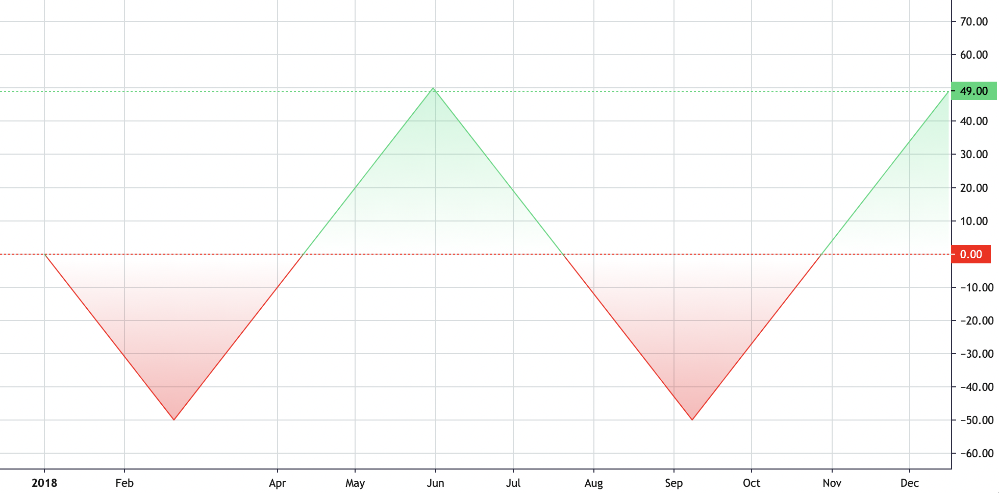

# Baseline series

A baseline chart is another way of displaying quantitative data. It's basically two colored areas (top and bottom) between the line connecting all data points and the baseline line.

A baseline series has a crosshair marker - a round mark which is moving along the series' line while the cursor is moving on a chart along the time scale.

"Baseline chart example")

## How to create baseline series

```js
const baselineSeries = chart.addBaselineSeries({
    baseValue: {
        type: 'price',
        price: 10,
    },
});

// set the data
baselineSeries.setData([
    { time: '2018-12-22', value: -32.51 },
    { time: '2018-12-23', value: -31.11 },
    { time: '2018-12-24', value: -27.02 },
    { time: '2018-12-25', value: -27.32 },
    { time: '2018-12-26', value: 25.17 },
    { time: '2018-12-27', value: 28.89 },
    { time: '2018-12-28', value: 25.46 },
    { time: '2018-12-29', value: 23.92 },
    { time: '2018-12-30', value: 22.68 },
    { time: '2018-12-31', value: 22.67 },
]);
```

## Data format

Each area series item should be a [whitespace](./whitespace-data.md) item or an object with the following fields:

- `time` ([Time](./time.md)) - item time
- `value` (`number`) - item value

## Customization

Different colors may be set for the upper and bottom parts of the series.
These colors blend into one another in the middle of the area.

Also, the crosshair marker, which is enabled by default, can either be disabled or have its radius adjusted.

A baseline series interface can be customized using the following set of options:

|Name|Type|Default|Description|
|-|----|-------|-|
|`baseValue`|`BaseValueType`|`{type: 'price', price: 0}`|Base value of the series|
|`topFillColor1`|`string`|`rgba(38, 166, 154, 0.28)`|The first color of the top area|
|`topFillColor2`|`string`|`rgba(38, 166, 154, 0.05)`|The second color of the top area.|
|`topLineColor`|`string`|`rgba(38, 166, 154, 1)`|The line color of the top area|
|`bottomFillColor1`|`string`|`rgba(239, 83, 80, 0.05)`|The first color of the bottom area|
|`bottomFillColor2`|`string`|`rgba(239, 83, 80, 0.28)`|The second color of the bottom area|
|`bottomLineColor`|`string`|`rgba(239, 83, 80, 1)`|The line color of the bottom area|
|`lineWidth`|`number`|`3`|Line width|
|`lineStyle`|[LineStyle](./constants.md#linestyle)|`LineStyle.Solid`|Line style|
|`crosshairMarkerVisible`|`boolean`|`true`|Show the crosshair marker|
|`crosshairMarkerRadius`|`number`|`4`|Crosshair marker radius in pixels|
|`crosshairMarkerBorderColor`|`string`|`''`|Crosshair marker border color. An empty string falls back to the the color of the series under the crosshair|
|`crosshairMarkerBackgroundColor`|`string`|`''`|The crosshair marker background color. An empty string falls back to the the color of the series under the crosshair|
|`lastPriceAnimation`|[LastPriceAnimationMode](./constants.md#lastpriceanimationmode)|`'LastPriceAnimationMode.Disabled'`|Last price animation mode|

### Examples

- set initial options for area series:

    ```js
    const baselineSeries = chart.addBaselineSeries({
        topFillColor1: 'rgba(21, 146, 230, 0.4)',
        topFillColor2: 'rgba(21, 146, 230, 0)',
        bottomFillColor1: 'rgba(21, 146, 230, 0)',
        bottomFillColor2: 'rgba(21, 146, 230, 0.4)',
        topLineColor: 'rgba(21, 146, 230, 1)',
        lineStyle: 0,
        lineWidth: 3,
        crosshairMarkerVisible: false,
        crosshairMarkerRadius: 3,
        crosshairMarkerBorderColor: 'rgb(255, 255, 255, 1)',
        crosshairMarkerBackgroundColor: 'rgb(34, 150, 243, 1)',
    });
    ```

- change options after series is created:

    ```js
    // for example, let's override line width and color only
    baselineSeries.applyOptions({
        topLineColor: 'rgba(255, 44, 128, 1)',
        lineWidth: 1,
    });
    ```

## What's next

- [Customization](./customization.md)
- [Constants](./constants.md)
- [Time](./time.md)
